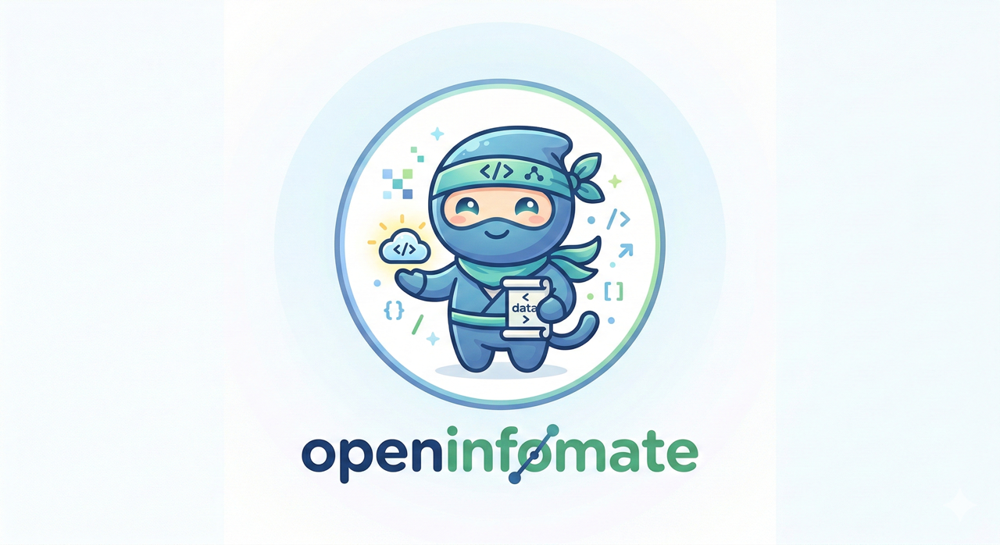
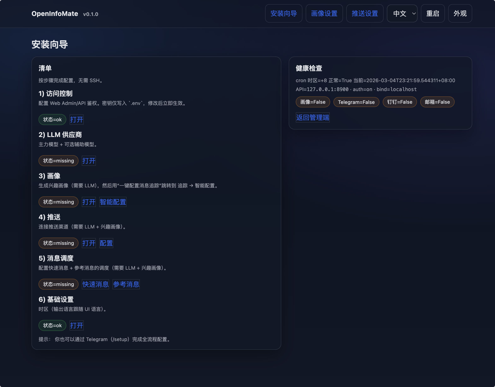
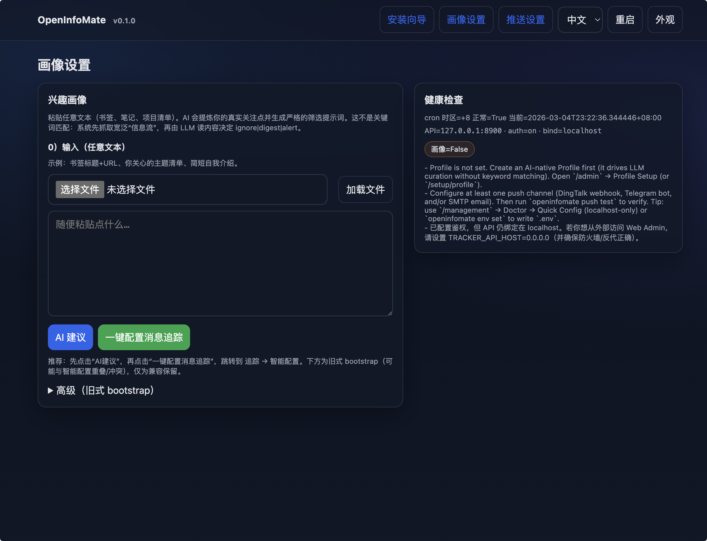
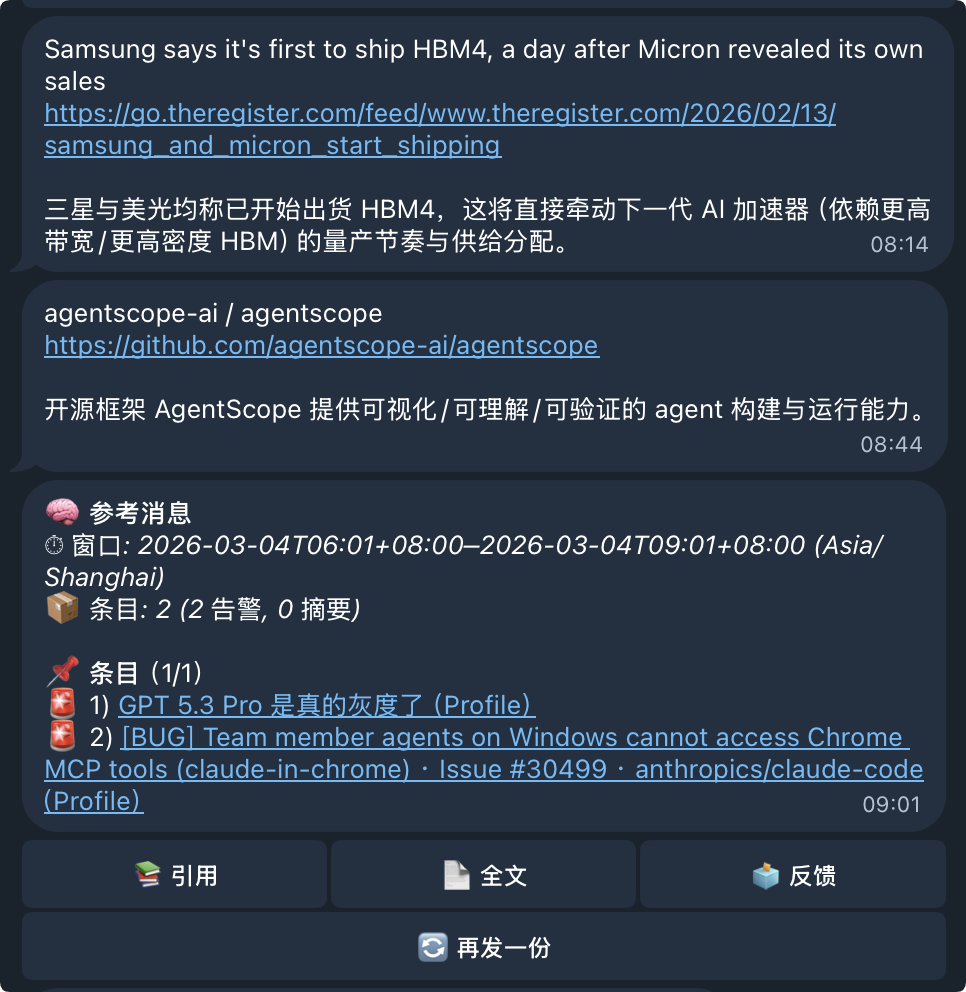

# OpenInfoMate🥷 ———— 定制化信息发现与追踪，为你量身定制的智能信息伙伴



<p align="center">
  
  
</p>
<p align="center">
  
</p>

OpenInfoMate🥷 是一个“越用越聪明”的信息助手：把 **你感兴趣的内容变成可执行的追踪策略**，从开放信息源里持续发现、去重、筛选与推送高质量内容。

## 重点能力

- **智能配置**：从输入 / 自然语言需求生成可执行计划（Topic/Source/Policy），并支持自动扩源与自愈。
- **多源抓取**：RSS/Atom、Web 搜索、GitHub（releases/issues/pulls/commits）等。
- **智能推送**：重要信息即时推送与参考信息定时推送；支持 Telegram。 
- **自动扩源**：自动从网络搜索发现新源，openinfomate评级筛选后可自动扩展。

## 快速开始

前提：Linux + Docker（默认使用 Docker bridge 网络；仅暴露 Web Admin/API 端口）。

一行启动（会下载 `docker-compose.ghcr.yml` 并拉取 `ghcr.io/pricx/openinfomate:latest`）：

```bash
mkdir -p ~/openinfomate && cd ~/openinfomate && curl -fsSLO https://raw.githubusercontent.com/Pricx/openinfomate/main/docker-compose.ghcr.yml && docker compose -f docker-compose.ghcr.yml up -d
```

打开管理后台：
- `http://127.0.0.1:${OPENINFOMATE_API_PORT:-8899}/admin`

如果你必须让容器访问宿主机的 `127.0.0.1`（例如你的 LLM gateway 只绑定在宿主机 loopback），使用 host 网络覆盖文件：

```bash
docker compose -f docker-compose.ghcr.yml -f docker-compose.host.yml up -d
```

重置到“全新安装”（会删除数据卷）：

```bash
docker compose -f docker-compose.ghcr.yml down -v
```
## 配置安装

进入 `http://127.0.0.1:${OPENINFOMATE_API_PORT:-8899}/setup/wizard`**安装向导**

访问控制：配置 web 管理端用户名与密码。

LLM供应商：填入 OpenAI 兼容格式的 API，并点击“测试主力模型（LLM）“ 以及 ”测试辅助模型（LLM）”，并等待通过。


### 智能配置

推荐路径：
- 先在 `http://127.0.0.1:${OPENINFOMATE_API_PORT:-8899}/setup/profile` 点击 **AI建议**
- 再点击 **一键配置消息追踪** 跳转到 管理后台 → 追踪 → 智能配置

智能配置会生成/更新：Topics、搜索种子、扩源参数（探索/利用）、以及AI筛选策略。点击“应用”就能将AI建议的话题应用了～。

### Telegram Bot 申请与连接

1) 在 Telegram 搜索 `@BotFather` → 发送 `/newbot` → 按提示设置 bot 名称与用户名  
2) BotFather 会给你一个 Token（形如 `123456:ABC...`）  
3) 打开 `http://127.0.0.1:${OPENINFOMATE_API_PORT:-8899}/setup/push`：
   - 填入 `TRACKER_TELEGRAM_BOT_TOKEN`
   - （可选）填入 `TRACKER_TELEGRAM_BOT_USERNAME`
   - 点 “Generate Connect Link” → 在 Telegram 打开链接 → 点 `/start`

可选加固（建议私有 bot 使用）：
- `TRACKER_TELEGRAM_OWNER_USER_ID`：只允许 owner 执行配置命令

其它推送方式未经测试。

### 信息源

openinfomate 自带 [hn-popular-blogs-2025](https://gist.github.com/emschwartz/e6d2bf860ccc367fe37ff953ba6de66b)。

## 致谢

- SearxNG（Web 搜索后端）
- FastAPI / SQLAlchemy / Typer 等优秀开源生态
- 所有贡献者与反馈用户
